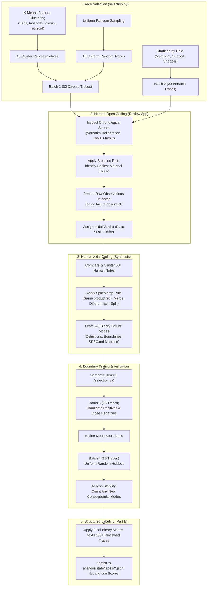

# Cartwheel HW4 Review Workflow & Methodology

This document formalizes the grounded theory trace evaluation lifecycle for Homework 4, distinguishing trace selection from human open and axial coding as mandated by `homework/module-2/hw4.md`.

---

### Key Distinctions in Methodology

1. **Role of `analysis/helpers/selection.py`**:
   - Solely a **trace sampling and retrieval helper**.
   - In Batch 1, it standardizes numeric execution features (`turn_count`, `tool_call_count`, `distinct_tools`, `has_retrieval`, `tokens`) to select diverse traces.
   - It **does not** identify error categories or predict failures.

2. **Role of the Human Reviewer (Open Coding)**:
   - Reads each trace with a blank slate (no pre-assigned categories).
   - Applies the **stopping rule**: stops at the earliest step that violates requirements or materially increases the probability of failure.
   - Records observations in plain English (`analysis/state/annotations.json`).

3. **Axial Coding**:
   - Performed after reviewing batches (e.g. 60 traces across Batches 1 and 2).
   - Groups raw human observations into 5 to 8 formal binary failure modes with boundaries, confirmed positive examples, and close negative examples.
